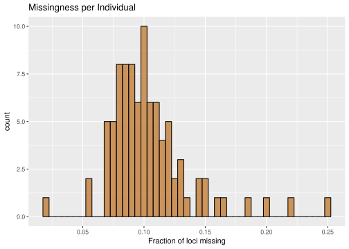

Oyster Genome Project
================
Jon Puritz
5/7/2018

Oyster Genome Bioinformatics
============================

This will walk through all code and outputs for generating various data sets from the resequencing efforts.

``` r
setwd("~/Oyster_Genome_Project")
```

Initial read trimming and mapping
---------------------------------

For this, I will be using a modified version of dDocent [LINK](./Scripts/dDocent_ngs)

Here are the first parameters used:

``` bash
cat config
```

    ## Number of Processors
    ## 40
    ## Maximum Memory
    ## 0
    ## Trimming
    ## no
    ## Assembly?
    ## no
    ## Type_of_Assembly
    ## 
    ## Clustering_Similarity%
    ## 
    ## Mapping_Reads?
    ## yes
    ## Mapping_Match_Value
    ## 1
    ## Mapping_MisMatch_Value
    ## 3
    ## Mapping_GapOpen_Penalty
    ## 5
    ## Calling_SNPs?
    ## no
    ## Email
    ## jpuritz@gmail.com

``` bash
./dDocent_ngs.sh config
```

This code is not run directly in the markdown notebook, but here is what the output would look like:

    dDocent run started Tue Apr 17 11:02:56 EDT 2018

    At this point, all configuration information has been entered and dDocent may take several hours to run.
    It is recommended that you move this script to a background operation and disable terminal input and output.
    All data and logfiles will still be recorded.
    To do this:
    Press control and Z simultaneously
    Type 'bg' without the quotes and press enter
    Type 'disown -h' again without the quotes and press enter

    Now sit back, relax, and wait for your analysis to finish.
    Trimming reads

    dDocent run started Tue Apr 17 11:17:32 EDT 2018

    At this point, all configuration information has been entered and dDocent may take several hours to run.
    It is recommended that you move this script to a background operation and disable terminal input and output.
    All data and logfiles will still be recorded.
    To do this:
    Press control and Z simultaneously
    Type 'bg' without the quotes and press enter
    Type 'disown -h' again without the quotes and press enter

    Now sit back, relax, and wait for your analysis to finish.
    Trimming reads
    Using BWA to map reads.
    [bam_sort_core] merging from 0 files and 40 in-memory blocks...
    [bam_sort_core] merging from 0 files and 40 in-memory blocks...
    [bam_sort_core] merging from 0 files and 40 in-memory blocks...
    [bam_sort_core] merging from 0 files and 40 in-memory blocks...
    [bam_sort_core] merging from 0 files and 40 in-memory blocks...
    [bam_sort_core] merging from 0 files and 40 in-memory blocks...
    [bam_sort_core] merging from 0 files and 40 in-memory blocks...
    [bam_sort_core] merging from 0 files and 40 in-memory blocks...
    [bam_sort_core] merging from 0 files and 40 in-memory blocks...

Mark Duplicates
---------------

These are PCR-free libraries, but many process generate duplicate sequences. This step is likely overly conservative, so I am open to suggestions for altering it, such as only removing optical duplicates. For Picard, I am using the recommended distance of 2500 for a patterned flowcell, like the HiSeq X 10.

``` bash
cat picard.sh
```

    ## #!/usr/bin/env bash
    ## 
    ## cat namelist | parallel -j 8 "java -Xms4g -jar /usr/local/bin/picard.jar MarkDuplicates I={}-RG.bam O={}-RGmd.bam M={}_dup_metrics.txt OPTICAL_DUPLICATE_PIXEL_DISTANCE=2500 TAGGING_POLICY=OpticalOnly &> md.{}.log"
    ## 
    ## echo -e "Picard has finished  in" `pwd` | mailx -s "Analysis has finished" jpuritz@uri.edu

``` bash
bash picard.sh
```

Now that duplicates are marked. Duplicate sequences and secondary alignments are removed.

``` bash
filter_bam(){
samtools view -@32 -h -F 0x100 -F 0x400 $1-RGmd.bam | mawk '$6 !~/[8-9].[SH]/ && $6 !~ /[1-9][0-9].[SH]/'| samtools view -@ 32 -b
}

export -f filter_bam
cat namelist | parallel -j 8 "filter_bam {} > {}.F.bam"
```

Now, megre all the individual bam files into a single bam file for easier parallelized variant calling

``` bash
ls *.F.bam > bam.list
samtools merge -@64 -f filter.merged.bam -b bam.list 
samtools index -@64 filter.merged.bam
```

Variant Calling
---------------

Run dDocent again to generate the variant calls and then zip the huge VCF file!

``` bash
cat config2
./dDocent_ngs.sh config2
gzip TotalRawSNPs.vcf
```

This produced a massive raw variants file!

``` bash
vcftools --gzvcf TotalRawSNPs.vcf.gz
```

    VCFtools - 0.1.15
    (C) Adam Auton and Anthony Marcketta 2009

    Parameters as interpreted:
        --gzvcf TotalRawSNPs.vcf.gz

    Using zlib version: 1.2.7
    After filtering, kept 90 out of 90 Individuals
    After filtering, kept 56358904 out of a possible 56358904 Sites
    Run Time = 2269.00 seconds

Variant Filtering
-----------------

First step is to remove sites with a QUALITY score below 20 and those sites that have more than 80% missing data

``` bash
vcftools --gzvcf TotalRawSNPs.vcf.gz --minQ 20 --recode --recode-INFO-all --out TRS --max-missing 0.20
```

    VCFtools - 0.1.15
    (C) Adam Auton and Anthony Marcketta 2009

    Parameters as interpreted:
            --gzvcf TotalRawSNPs.vcf.gz
            --recode-INFO-all
            --minQ 20
            --max-missing 0.2
            --out TRS
            --recode

    Using zlib version: 1.2.7
    After filtering, kept 90 out of 90 Individuals
    Outputting VCF file...
    After filtering, kept 43464810 out of a possible 56358904 Sites
    Run Time = 17313.00 seconds

Next step is to mark any genotypes with less than 5 reads as missing

``` bash
vcftools --vcf TRS.recode.vcf --minDP 5 --recode --recode-INFO-all --out TRSdp5
```

    VCFtools - 0.1.15
    (C) Adam Auton and Anthony Marcketta 2009

    Parameters as interpreted:
            --vcf TRS.recode.vcf
            --recode-INFO-all
            --minDP 5
            --out TRSdp5
            --recode

    After filtering, kept 90 out of 90 Individuals
    Outputting VCF file...
    After filtering, kept 43464810 out of a possible 43464810 Sites
    Run Time = 20497.00 seconds

Next, remove sites with more than 50% missing data and a minor allele frequency of less than 0.001

``` bash
vcftools --vcf TRSdp5.recode.vcf --max-missing 0.5 --maf 0.001 --recode --recode-INFO-all --out TRSdp5g5
```

    VCFtools - 0.1.15
    (C) Adam Auton and Anthony Marcketta 2009

    Parameters as interpreted:
            --vcf TRSdp5.recode.vcf
            --recode-INFO-all
            --maf 0.001
            --max-missing 0.5
            --out TRSdp5g5
            --recode

    After filtering, kept 90 out of 90 Individuals
    Outputting VCF file...
    After filtering, kept 36406749 out of a possible 43464810 Sites
    Run Time = 20707.00 seconds

Generate missingness data for each individual

``` bash
vcftools --vcf TRSdp5g5.recode.vcf --missing-indv --out TRSdp5g5MI
```

``` r
library(wesanderson)
library(ggplot2)
missing <- read.table("TRSdp5g5MI.imiss", header = TRUE)
missing <- as.data.frame(missing)

col <- wes_palette("Moonrise2",4, "discrete")

j2 <- ggplot(missing, aes(x=F_MISS)) +
  geom_histogram(alpha =0.8, binwidth = 0.005, fill=col[2], col="black") +
  ggtitle("Missingness per Individual")+ xlab("Fraction of loci missing")
  
j2
```



We are starved for individuals for this analysis, so I am relucant to cut any given that the extreme is 25% missing. Here is a list of the worst five samples which might be useful if we have money to resequence a few.

``` bash
cat <(head -1 TRSdp5g5MI.imiss ) <(mawk '!/F_MI/' TRSdp5g5MI.imiss | sort -k5 -r -n ) | head -6 | column -t
```

    ## INDV       N_DATA    N_GENOTYPES_FILTERED  N_MISS   F_MISS
    ## HG_HG2M5   36406749  0                     9077525  0.249336
    ## LM_1_pool  36406749  0                     7965065  0.21878
    ## LM_8       36406749  0                     7200835  0.197788
    ## CL_5       36406749  0                     6729523  0.184843
    ## LM_3       36406749  0                     5940542  0.163171

It's actually unfortunate that 3 of these 5 are from the Laguna Madre sample which is our most southern sample from near the Mexico border in TX.

Next, reduce the variants to only those with less than 25% missing data

``` bash
vcftools --vcf TRSdp5g5.recode.vcf --max-missing 0.75 --recode --recode-INFO-all --out TRSdp5g75
```

    VCFtools - 0.1.15
    (C) Adam Auton and Anthony Marcketta 2009

    Parameters as interpreted:
            --vcf TRSdp5g5.recode.vcf
            --recode-INFO-all
            --max-missing 0.75
            --out TRSdp5g75
            --recode

    After filtering, kept 90 out of 90 Individuals
    Outputting VCF file...
    After filtering, kept 30077264 out of a possible 36406749 Sites
    Run Time = 12081.00 seconds

Next, split the VCF files into nDNA and mtDNA for further filtering

``` bash
zcat TRSdp5g75.recode.vcf.gz| mawk '!/NC_007175.2/' > TRSdp5g75.nDNA.vcf
```

``` bash
zcat TRSdp5g75.recode.vcf.gz | head -10000 | mawk '/#/' > header
cat header <(zcat TRSdp5g75.recode.vcf.gz |head -20000| mawk '/NC_007175.2/') > TRSdp5g75.mtDNA.vcf
```

``` bash
vcffilter -s -f "AB < 0.001" TRSdp5g75.mtDNA.vcf | vcffilter -s -f "QUAL / DP > 0.25" > TRSdp5g75.mtDNA.F.vcf
vcfallelicprimitives -k -g TRSdp5g75.mtDNA.F.vcf | sed 's:\.|\.:\.\/\.:g' > TRSdp5g75mtDNAF.prim
vcftools --vcf TRSdp5g75mtDNAF.prim --remove-indels --recode --recode-INFO-all --out SNP.TRSdp5g75mtDNA
```

    ## 
    ## VCFtools - 0.1.15
    ## (C) Adam Auton and Anthony Marcketta 2009
    ## 
    ## Parameters as interpreted:
    ##  --vcf TRSdp5g75mtDNAF.prim
    ##  --recode-INFO-all
    ##  --out SNP.TRSdp5g75mtDNA
    ##  --recode
    ##  --remove-indels
    ## 
    ## After filtering, kept 90 out of 90 Individuals
    ## Outputting VCF file...
    ## After filtering, kept 1337 out of a possible 1375 Sites
    ## Run Time = 1.00 seconds

``` basheval
./dDocent_ngs_filters TRSdp5g75.nDNA.vcf TRSdp5g75FnDNA
```

    This script will automatically filter a FreeBayes generated VCF file using criteria related to site depth,
    quality versus depth, allelic balance at heterzygous individuals, and paired read representation.
    The script assumes that loci and individuals with low call rates (or depth) have already been removed.

    Contact Jon Puritz (jpuritz@gmail.com) for questions and see script comments for more details on particular filters

    Is this from a mixture of SE and PE libraries? Enter yes or no.
    no
    Number of sites filtered based on allele balance at heterozygous loci, locus quality, and mapping quality / Depth
     5618270 of 30076069

    Number of additional sites filtered based on properly paired status
     842317 of 24457799

    Number of sites filtered based on high depth and lower than 2*DEPTH quality score
     3220058 of 24457799


                                                   Histogram of mean depth per site

      3.5e+06 ++-----+------+------+------+------+------+------+-------+------+------+------+------+------+------+-----++
              +      +      +      +      +      +      +      'meandepthpersite' using (bin($1,binwidth)):(1.0) ****** +
              |                                                        *      *                                         |
        3e+06 ++                                                       *      ********                                 ++
              |                                                *********      *      *                                  |
              |                                                *       *      *      *                                  |
              |                                                *       *      *      *                                  |
      2.5e+06 ++                                               *       *      *      *                                 ++
              |                                                *       *      *      *                                  |
              |                                                *       *      *      *                                  |
        2e+06 ++                                        ********       *      *      *                                 ++
              |                                         *      *       *      *      *                                  |
              |                                         *      *       *      *      *                                  |
      1.5e+06 ++                                        *      *       *      *      *                                 ++
              |                                  ********      *       *      *      *                                  |
              |                           ********      *      *       *      *      ********                           |
        1e+06 ++            ***************      *      *      *       *      *      *      *                          ++
              |      ********      *      *      *      *      *       *      *      *      *                           |
              ********      *      *      *      *      *      *       *      *      *      *                           |
              *      *      *      *      *      *      *      *       *      *      *      *                           |
       500000 *+     *      *      *      *      *      *      *       *      *      *      *                          ++
              *      *      *      *      *      *      *      *       *      *      *      ********                    |
              *      *      *      *      *      *      *      *       *      *      *      *      ***************      +
            0 ***********************************************************************************************************
              10     11     12     13     14     15     16     17      18     19     20     21     22     23     24     25
                                                              Mean Depth

    The 95% cutoff would be 20
    Would you like to use a different maximum mean depth cutoff than 20, yes or no
    yes
    Please enter new cutoff
    30

    Number of sites filtered based on maximum mean depth
     177673 of 20501707

    Total number of sites filtered
     9752035 of 30076069

    Remaining sites
     20324034

    Filtered VCF file is called Output_prefix.FIL.recode.vcf

``` bash
vcfallelicprimitives -k -g TRSdp5g75FnDNA.FIL.recode.vcf | sed 's:\.|\.:\.\/\.:g' | vcftools --vcf - --remove-indels --recode --recode-INFO-all --stdout --out SNP.TRSdp5g75FnDNA | pigz -c > SNP.TRSdp5g75FnDNA.vcf.gz
```

    VCFtools - 0.1.15
    (C) Adam Auton and Anthony Marcketta 2009

    Parameters as interpreted:
            --vcf [stdin]
            --recode-INFO-all
            --out SNP.TRSdp5g75FnDNA
            --recode
            --remove-indels
            --stdout

    After filtering, kept 90 out of 90 Individuals
    Outputting VCF file...
    After filtering, kept 29175863 out of a possible 34843027 Sites
    Run Time = 53580.00 seconds

``` bash
vcfallelicprimitives -k -g TRSdp5g75FnDNA.FIL.recode.vcf | sed 's:\.|\.:\.\/\.:g' | vcftools --vcf - --keep-only-indels --recode --recode-INFO-all --stdout --out INDELs.TRSdp5g75FnDNA | pigz -c > INDELs.TRSdp5g75FnDNA.vcf.gz
```

    VCFtools - 0.1.15
    (C) Adam Auton and Anthony Marcketta 2009

    Parameters as interpreted:
            --vcf [stdin]
            --recode-INFO-all
            --keep-only-indels
            --out INDELs.TRSdp5g75FnDNA
            --recode
            --stdout

    After filtering, kept 90 out of 90 Individuals
    Outputting VCF file...
    After filtering, kept 5667164 out of a possible 34843027 Sites
    Run Time = 53771.00 seconds

### I also created a few extra gzipped VCF files with different levels of minor allele frequency cutoffs and missing data.

Minor Allele Frequency greater than 1%

``` bash
vcftools --gzvcf SNP.TRSdp5g75FnDNA.vcf.gz --maf 0.01 --recode --recode-INFO-all --out SNP.TRSdp5g75FnDNAmaf01 --stdout | pigz -c > SNP.TRSdp5g75FnDNAmaf01.vcf.gz
```

    VCFtools - 0.1.15
    (C) Adam Auton and Anthony Marcketta 2009

    Parameters as interpreted:
            --gzvcf SNP.TRSdp5g75FnDNA.vcf.gz
            --recode-INFO-all
            --maf 0.01
            --out SNP.TRSdp5g75FnDNAmaf01
            --recode
            --stdout

    Using zlib version: 1.2.7
    After filtering, kept 90 out of 90 Individuals
    Outputting VCF file...
    After filtering, kept 23579809 out of a possible 29175863 Sites
    Run Time = 10774.00 seconds

Minor Allele Frequency greater than 5%

``` bash
vcftools --gzvcf SNP.TRSdp5g75FnDNA.vcf.gz --maf 0.05 --recode --recode-INFO-all --out SNP.TRSdp5g75FnDNAmaf01 --stdout | pigz -c > SNP.TRSdp5g75FnDNAmaf05.vcf.gz
```

    VCFtools - 0.1.15
    (C) Adam Auton and Anthony Marcketta 2009

    Parameters as interpreted:
            --gzvcf SNP.TRSdp5g75FnDNA.vcf.gz
            --recode-INFO-all
            --maf 0.05
            --out SNP.TRSdp5g75FnDNAmaf05
            --recode
            --stdout

    Using zlib version: 1.2.7
    After filtering, kept 90 out of 90 Individuals
    Outputting VCF file...
    After filtering, kept 10983744 out of a possible 29175863 Sites

Minor Allele Frequency greater than 5% and less than 5% missing data

``` bash
vcftools --gzvcf SNP.TRSdp5g75FnDNA.vcf.gz --maf 0.05 --recode --recode-INFO-all --out SNP.TRSdp5g95FnDNAmaf05 --max-missing 0.95 --stdout | pigz -c > SNP.TRSdp5g95FnDNAmaf05.vcf.gz
```

    VCFtools - 0.1.15
    (C) Adam Auton and Anthony Marcketta 2009

    Parameters as interpreted:
            --gzvcf SNP.TRSdp5g75FnDNA.vcf.gz
            --recode-INFO-all
            --maf 0.05
            --max-missing 0.95
            --out SNP.TRSdp5g95FnDNAmaf05
            --recode
            --stdout

    Using zlib version: 1.2.7
    After filtering, kept 90 out of 90 Individuals
    Outputting VCF file...
    After filtering, kept 7030071 out of a possible 29175863 Sites
    Run Time = 4742.00 seconds
