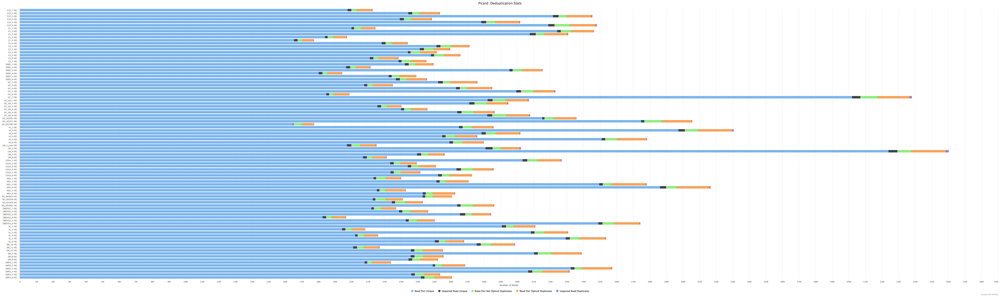

## Sequencing Quality Reports

A `MultiQC` report has been generated incorporating information about number of reads, trimming, mapping, and deduplication.  To view the full report, download the entire contents of [multiqc](./multiqc), and open the html file in a web browser.  I have included a few more informative graphics below.

### Sequence Quality

In general, we obtained high quality sequence data.  Below, is a summary of mean quality scores for both trimmed and untrimmed data:

We also had consistency in GC content across all samples.

### Trimming

Because of the relatively high quality of sequence, trimming was minimal for most samples.  It is important to note the large variance in the number of reads (before and after trimming) across samples.

### Mapping

The relative read mappings also reflect this large difference in the number of reads per sample.

