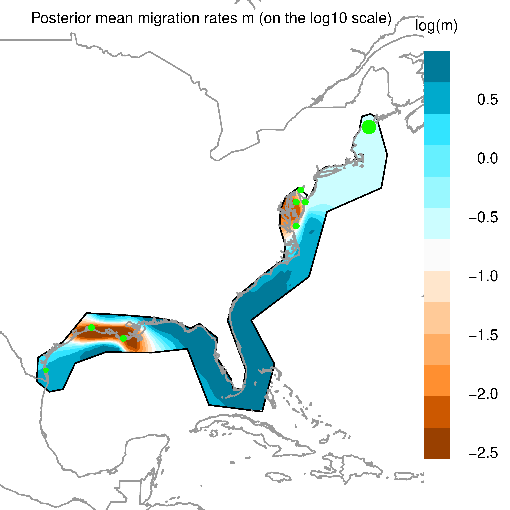
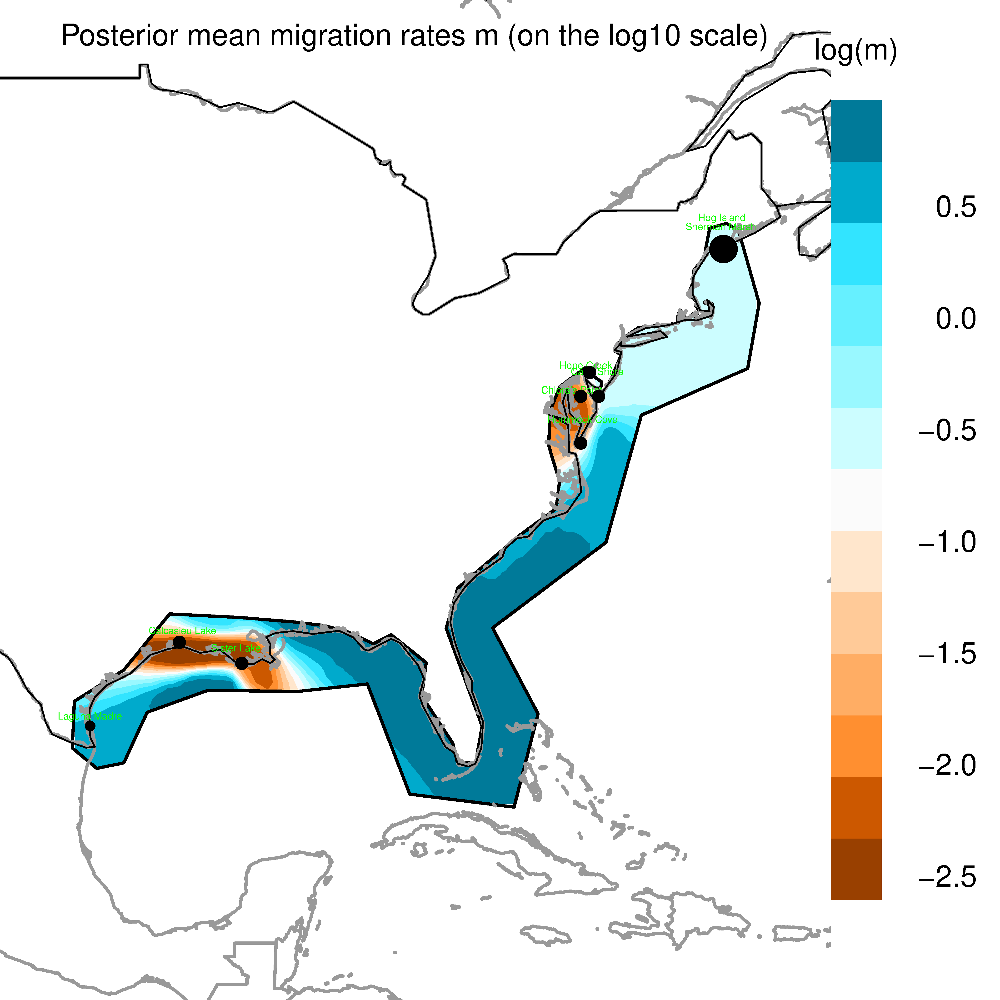
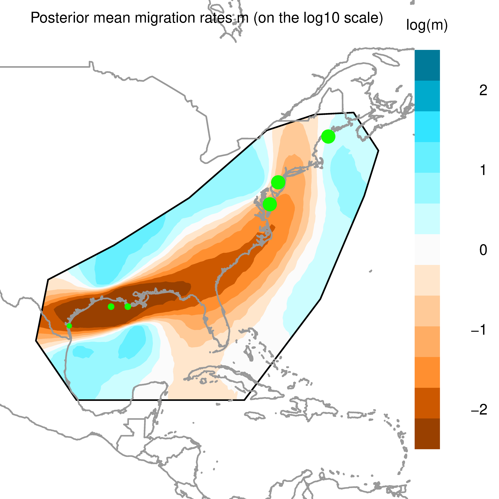
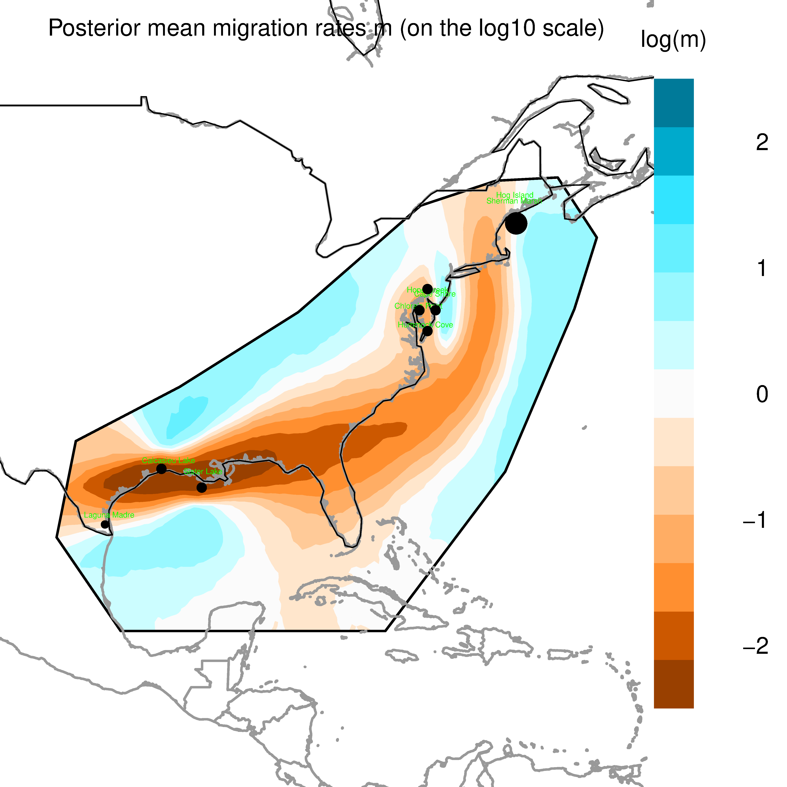

# EEMS Analysis

This directory contains the results and plots from [EEMS](https://github.com/dipetkov/eems) analysis done on a pruned set of 10 thousand SNPs and on a pruned set of 50 thousand snps. Results were about the same between the larger group and the smaller group of snps. 

'src' contains the scripts used to format the data and produce the plots. 'modified_metadata_w_approx_coords.csv' is the metadata file with additional columns for 'ApproxLong' and 'ApproxLat'. These are the coordinates used in the analysis for the samples in the original metadata that did not have exact coordinates. I got them by searching the sample locations by name on google maps. In addition, in this metadata file all the latitudes and longitudes have been converted to decimal degrees.

## Plots

Plots are contained in subdirectories of '10KThinnedRandomSNPs13PCs' and '50KThinnedRandomSNPs13PCs'. EEMS requires habitat boundaries to be input along with the data and I tried two different versions of the boundaries. One where the boundary followed the coastline (10/50k_coast-xxx.png) and one where the boundary is much larger and includes land (10k_include_land-xxx.png). I also tried two different versions of the larger, 'include_land', boundary, one where the number of demes in the habitat grid was set to 200 and one where the number of demes was increased to 500. 

### Don't include land

Circles are demes that the samples have been assigned to (more samples = bigger circle), the black line is the habitat boundary I input.

The version using 50k SNPs. The pattern is essentially the same. Labels are visible here to show which population corresponds with which deme.

### Include land

The version of the plot with only 200 demes. Note that some of the populations that were separate above have been combined into the same deme in this larger, less precise map.

The version of the plot with 500 demes. The populations are once again separate, the pattern is pretty similar though. This version took much longer to run. 

There are many more plots in the plots directories, including plots of within deme diversity and diagnostic plots. The [EEMS documentation](https://github.com/dipetkov/eems/blob/master/Documentation/EEMS-doc.pdf) is a good guide in interpreting these plots.

## Notes

I kept notes while performing this analysis, provided here as a pdf. They are unpolished but pretty thorough. Hopefully they will help with any questions about why I used the hyperparameters I used or how the included scripts were used. They should be used in conjunction with the [EEMS documentation](https://github.com/dipetkov/eems/blob/master/Documentation/EEMS-doc.pdf) to reproduce the results, they will not provide all the details needed to use the EEMs program itself. 

 
