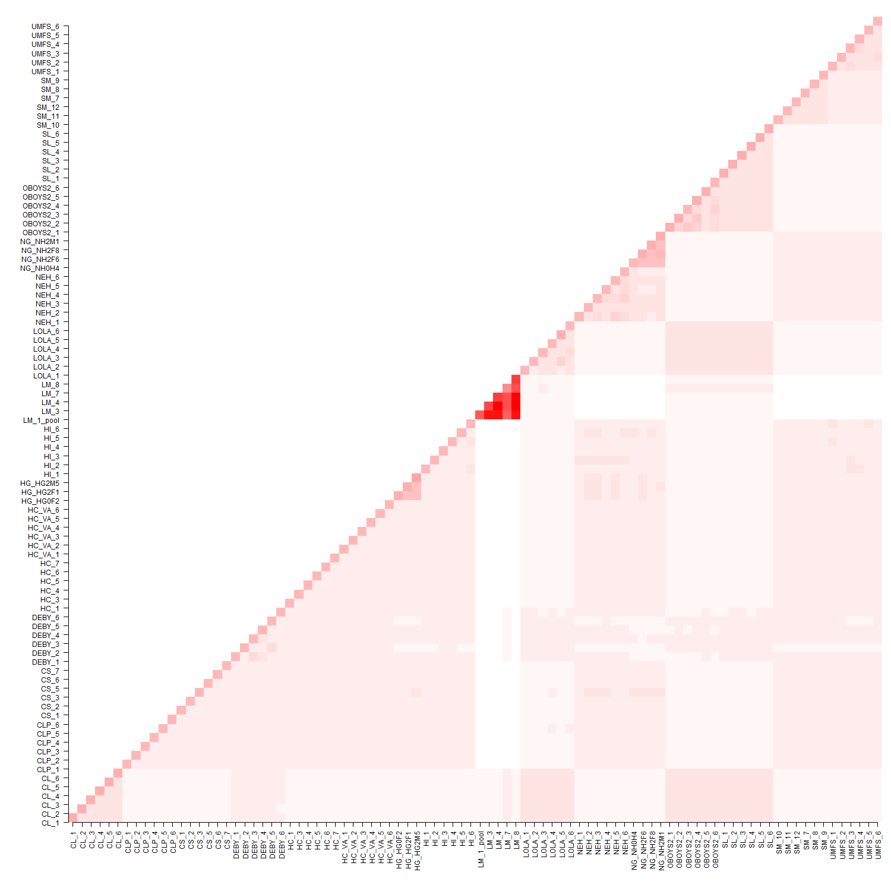

# 2019-03-04 KBW

## Relatedness Analysis

We used vcftools using the --relatedness option in order to get
relatedness comparisons between all individuals using
the "Combined.SNP.TRSdp5g1FnDNAmaf052alleles.vcf.gz" VCF file. The
--relatedness option calculates relatedness by based on the method of
Yang et al, Nature Genetics 2010 (doi:10.1038/ng.608). Specifically,
calculate the unadjusted Ajk statistic. Expectation of Ajk is zero for
individuals within a populations, and one for an individual with
themselves. 

The following code was used in order to get a visual of the data and
see which individuals were most related to one another. The data is
first transformed from a long to wide format to create a triangle
matrix. The data is then plotted using a heat map to visualize the degree of
relatedness between each individual. 

```{r}
rel <- read.csv("../data/relatedness_data/relatedness_stats.relatedness", 
                sep="\t",
                header=TRUE,
                stringsAsFactors=FALSE)

library(reshape2)

new.rel <- dcast(rel, INDV2 ~ INDV1, value.var = "RELATEDNESS_AJK")
rownames(new.rel) <- new.rel[,1]
new.rel <- new.rel[,-1]

col = colorRampPalette(c("white", "red"))(30)

png("relatednessPlot.png", height=1500, width=1500)
par(mar = c(8,8,2,1))
image(1:90, 1:91, as.matrix(new.rel), axes = FALSE, xlab="", ylab="", col=col)
axis(1, at=1:90, las=2, labels=rownames(new.rel))
axis(2, at=1:90, las=2, labels=colnames(new.rel))
dev.off()
```



This plot can be seen in the figures folder "figures/5relatedness/"

Most of the highly related individuals fall into the inbred or
selection lines. However, quite interestingly, the Laguna Madre (LM) samples are even more
highly related. In order to get a better idea of what the relatedness
values are for these highly related individuals, here are all the
individuals that have a relatedness of >= 0.4:

```{r}
        INDV1    INDV2 RELATEDNESS_AJK
1543    DEBY_2   DEBY_5        0.459427
2612  HG_HG0F2 HG_HG2F1        0.945763
2613  HG_HG0F2 HG_HG2M5        0.939753
2666  HG_HG2F1 HG_HG2M5        0.919855
3062 LM_1_pool     LM_3        4.297240
3063 LM_1_pool     LM_4        4.357940
3064 LM_1_pool     LM_7        2.782320
3065 LM_1_pool     LM_8        4.334060
3107      LM_3     LM_4        4.733370
3108      LM_3     LM_7        3.086640
3109      LM_3     LM_8        4.688760
3151      LM_4     LM_7        3.131970
3152      LM_4     LM_8        4.755000
3194      LM_7     LM_8        3.103430
3319    LOLA_2   LOLA_5        0.632713
3505     NEH_1    NEH_5        0.583953
3569     NEH_3    NEH_4        0.417073
3571     NEH_3    NEH_6        0.485183
3602     NEH_4    NEH_6        0.445414
3691  NG_NH0H4 NG_NH2F6        0.846857
3692  NG_NH0H4 NG_NH2F8        0.848865
3693  NG_NH0H4 NG_NH2M1        0.854201
3719  NG_NH2F6 NG_NH2F8        0.951847
3720  NG_NH2F6 NG_NH2M1        0.993271
3746  NG_NH2F8 NG_NH2M1        0.952217
3797  OBOYS2_1 OBOYS2_2        0.493430
3798  OBOYS2_1 OBOYS2_3        0.734643
3799  OBOYS2_1 OBOYS2_4        0.533983
3801  OBOYS2_1 OBOYS2_6        0.432293
3821  OBOYS2_2 OBOYS2_3        0.419687
3822  OBOYS2_2 OBOYS2_4        0.684152
3824  OBOYS2_2 OBOYS2_6        0.433388
3844  OBOYS2_3 OBOYS2_4        0.407799
3846  OBOYS2_3 OBOYS2_6        0.517173
3867  OBOYS2_4 OBOYS2_6        0.464652
4087    UMFS_3   UMFS_4        0.428791
```
