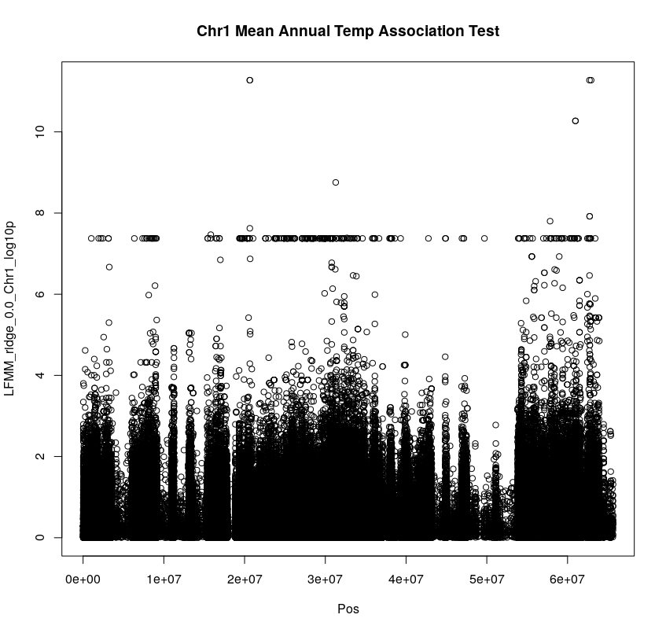
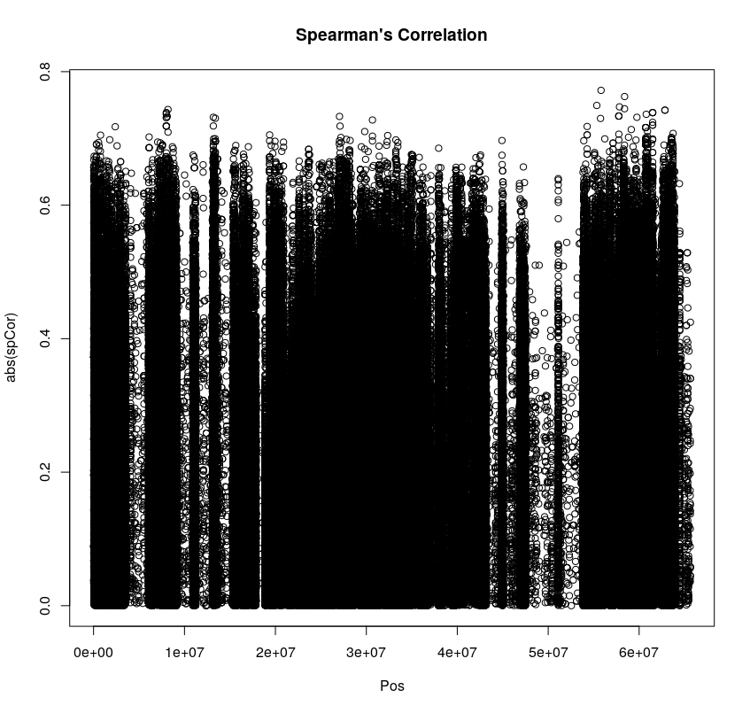

# Initial LFMM analysis

- I am starting with an lfmm ridge analysis of genotype on mean_temperature_celsius
- Combined modified_sample_metadata_4_20_19_ER.csv w/ modified_samplemetadata.csv using merge in R
	- "NOTES", "Ecotype", and "Sex" are columns that are present in both files BUT the information does not match. Cannot join on these
- Scaling the genotype matrix was causing issues (it introduced NAs). I realized that when subsetting to the wild populations, I was causing some loci to become fixed that weren't fixed before. Added a step to filter out fixed sites before scaling 
- Got my first set of results, environmental association test between mean_temperature_celsius and genotype for Chromosome 1

The comparison between correlation and lfmm ridge provides a quick sanity check, the signals seem to be in the same place
