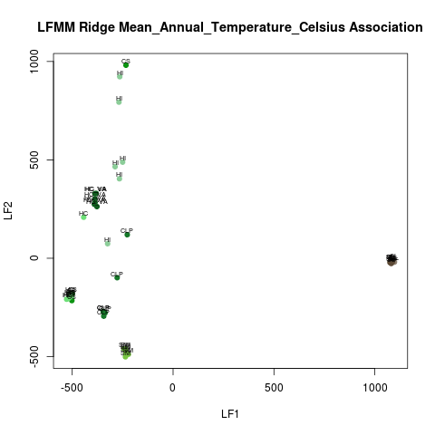
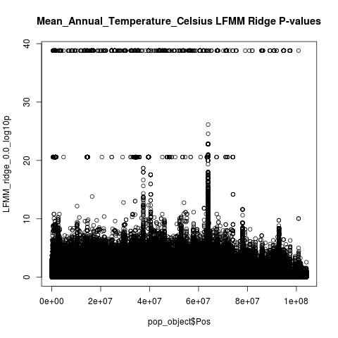
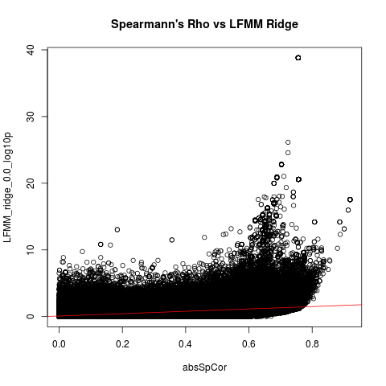

# 2019-04-27 Environmental Analysis Update

- I identified the bug that was leading to the wrong populations being selected: indexing was off by 1 between the metadata file I created and the genotype matrix
- Fixed the bug and refactored LFMMwild.R to make it more readable and usable
- Updated column names of the output file to match the format Bodie is using exactly
- TODO: get access to google drive to store large tables

## New plots with correct pops

