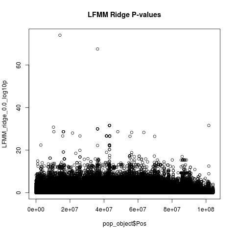
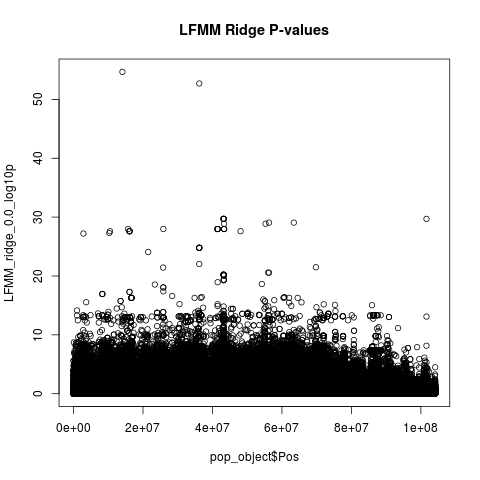
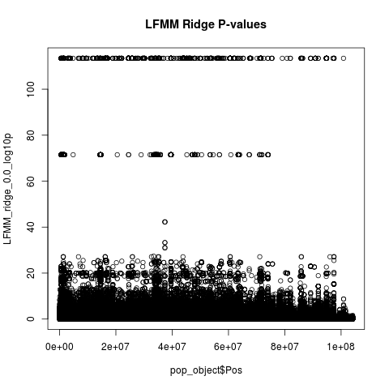
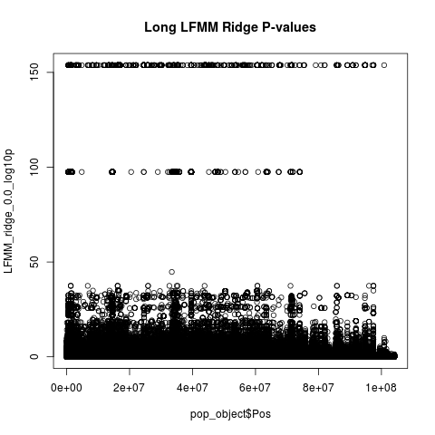
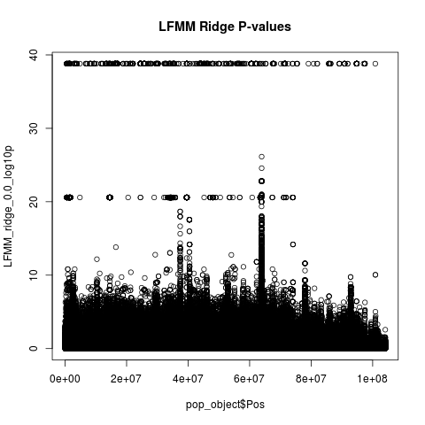
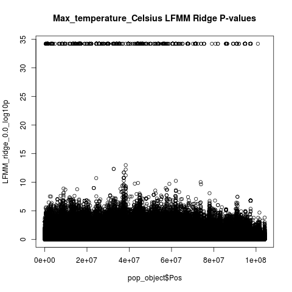
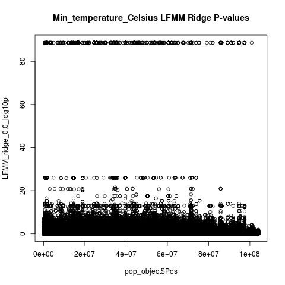
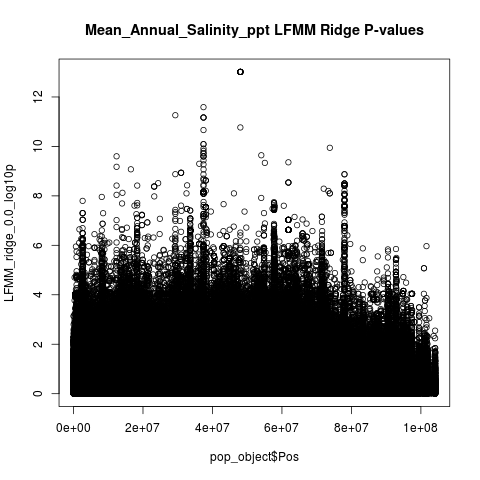
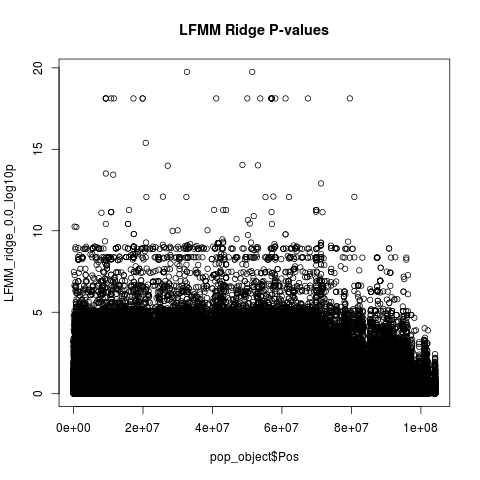

# Manhattan Plots for LFMM Ridge Environment Association

## Days below 0

## Days below 30

## Latitude

## Longitude

## Mean Temperature

## Max Temperature

## Min Temperature

## Mean Annual Salinity

## Temperature at Sampling

