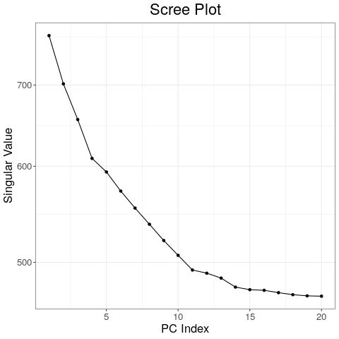

We were missing some files, corresponded with Bodie about these questions:

1) how many PCs were used in the PCAdapt analysis? I thought we decided on K=3 or K=4 for analysis. where is Scree plot? In the code it looks like K=20 was used.

1. Yes K=20 is what is in the code when using pcadapt. We tried 3 and 4 PCs and saw that both did not capture all of the variance. I can produce fresh scree plots to show this.

2) where is the code for vcftools where relatedness was estimated? And code for LD estimations for different window sizes is missing?

2A. There wasn't really any code other than a command line argument that went into calculating the relatedness for different sets of individuals (e.g. vcftools --gzvcf Combined.SNP.TRSdp5g1FnDNAmaf052alleles.vcf.gz --remove excludeSelection.txt --relatedness --out relatedness_stats_atlanticWildPop). However, the code for plotting the relatedness is here: https://github.com/jpuritz/OysterGenomeProject/blob/master/popstructureOutliers/src/5relatedness/relatedness_analysis.R and here is the notebook that describes the data that was used: https://github.com/jpuritz/OysterGenomeProject/blob/master/popstructureOutliers/notebook/2019-03-04_KBW_relatedness_analysis.md

2B. The code for the LD analysis was also just a shell script with a bunch of different runs of vcftools. I will grab that script from Jon's server and push it on to Github.
The script that was run to get the LD decay data is here: https://github.com/jpuritz/OysterGenomeProject/blob/master/popstructureOutliers/src/1LD_analysis/ldAnalysis.sh
- The files in this script (e.g. exclude_LM.txt and unrelated.txt) have the sample labels that are being excluded or included in the LD calculations. I can put those txt files in the github folder as well.

3) where is the code to make outlier plots with highlighted areas for misassemblies?

3. https://github.com/jpuritz/OysterGenomeProject/blob/master/popstructureOutliers/src/4outlier/combine_plots.R

4) where is the bedtools code to calculate number of outliers in different regions of the genome for your evolution poster?

4. I will get the command line arguments that I used compiled into a .sh script and get it onto github as well.
